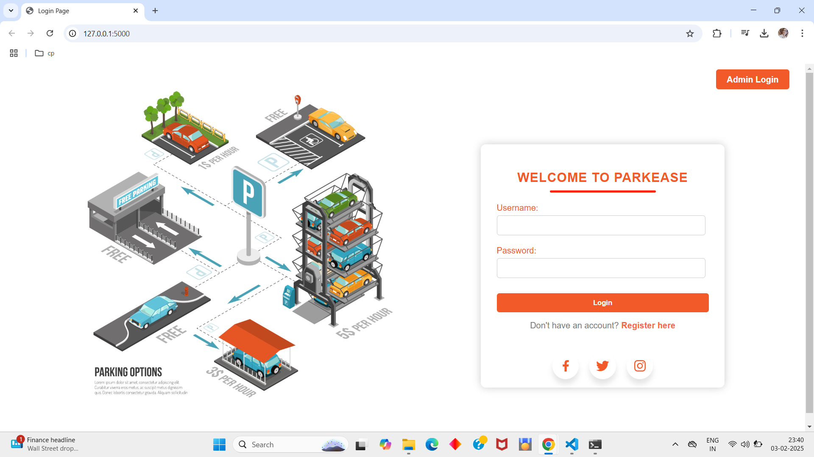
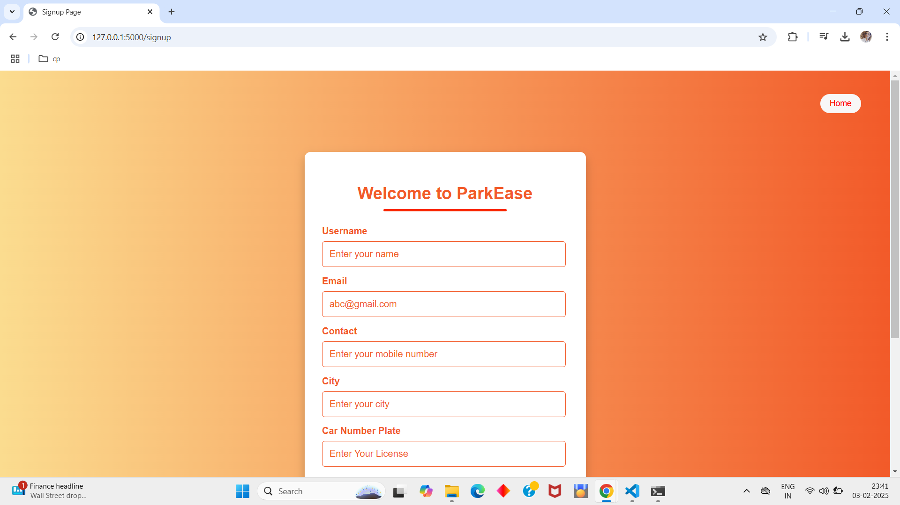
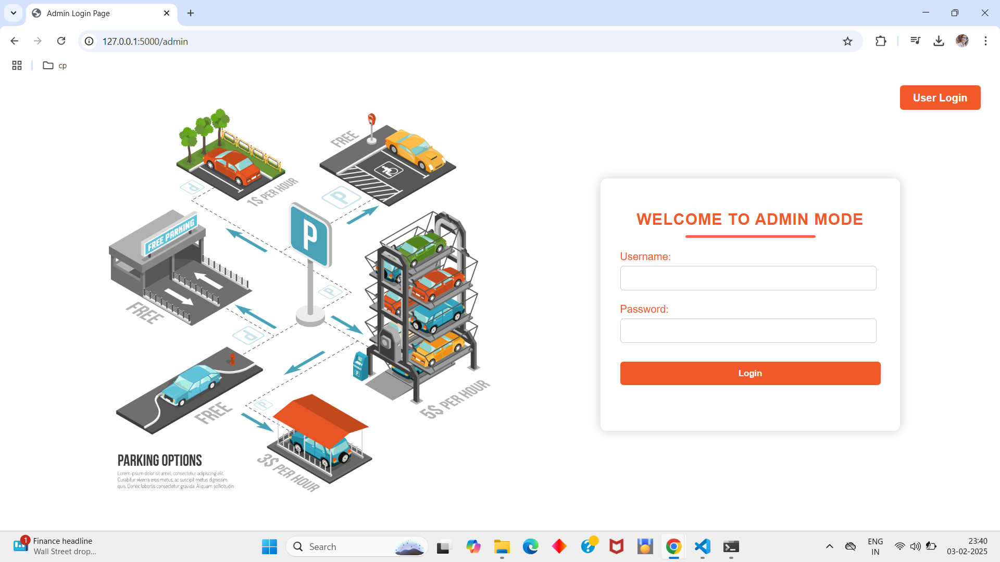
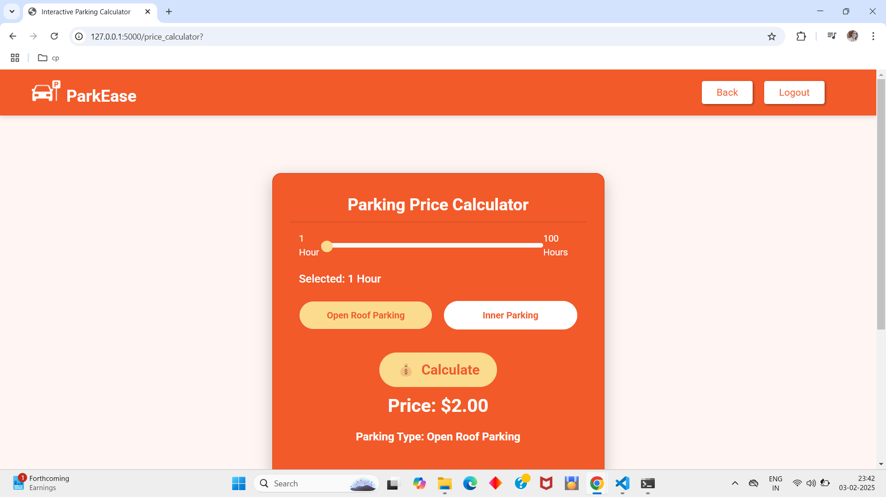
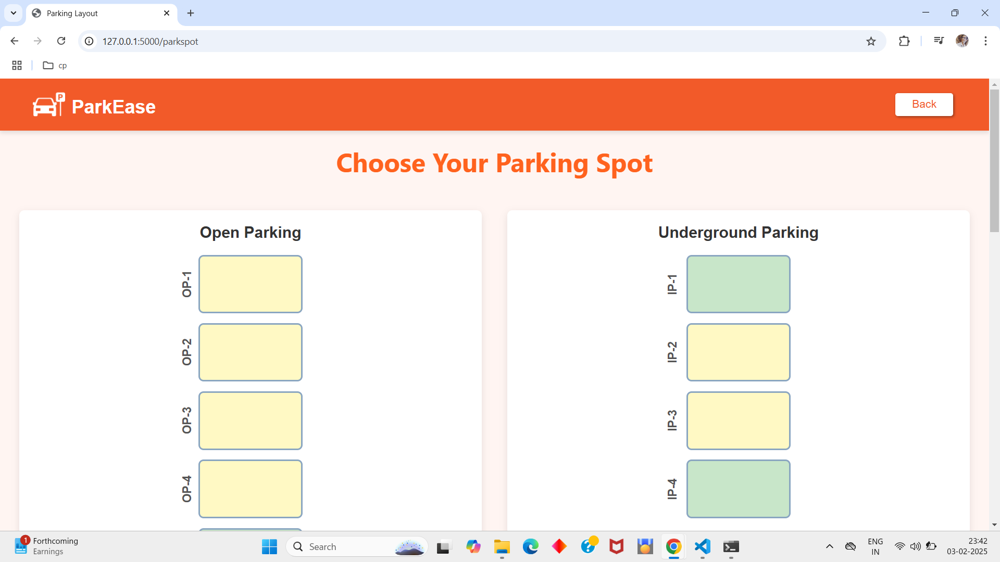
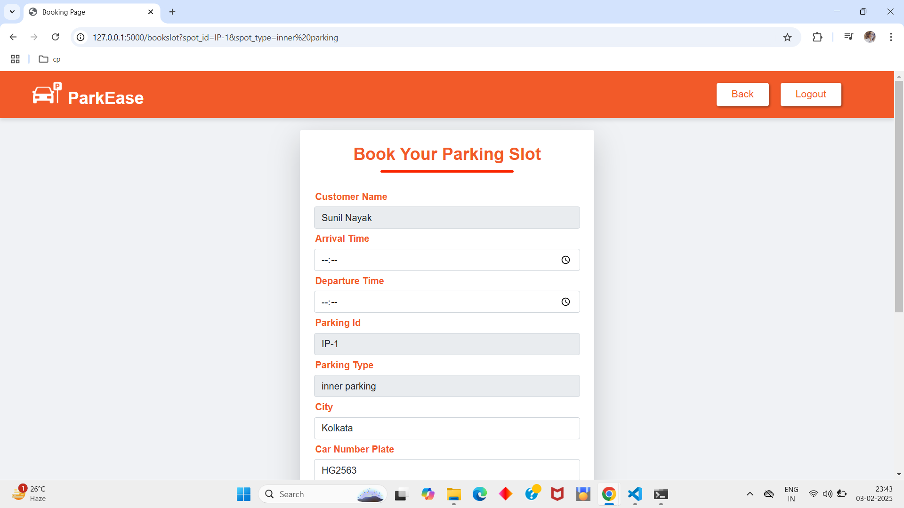
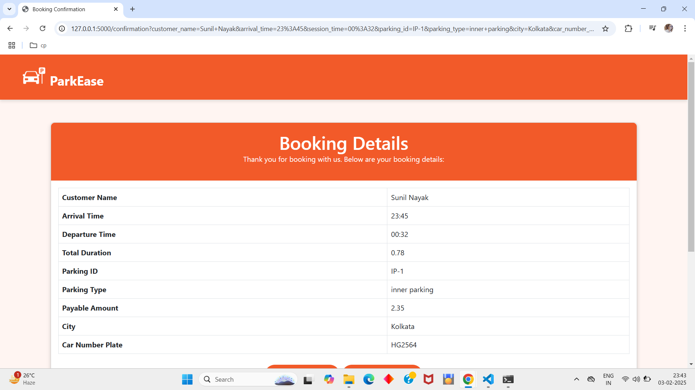
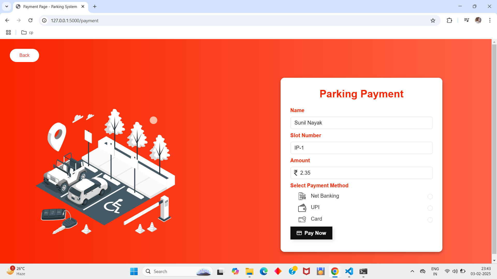
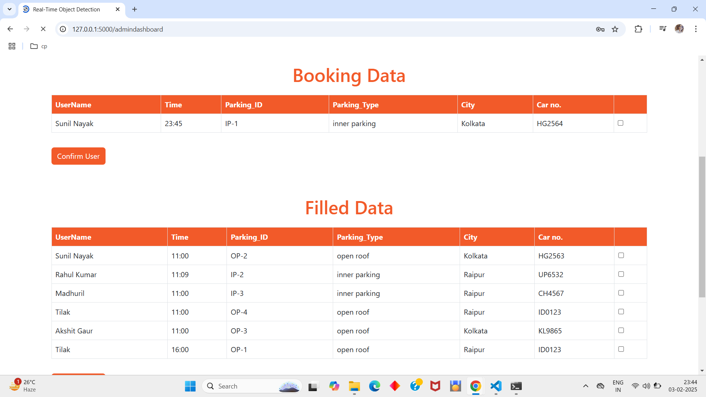
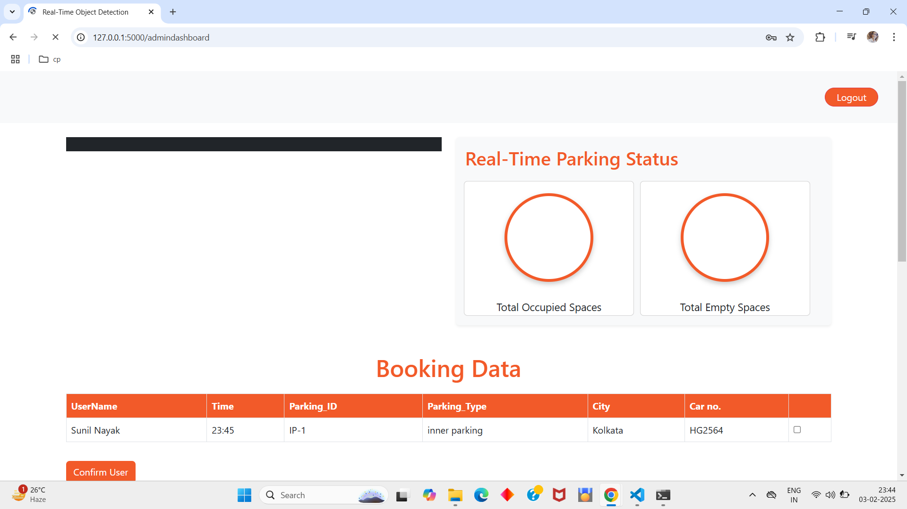

# Real-time Parking Detection and Reservation

This repository contains the implementation of a **Real-time Parking Detection and Reservation System** using **YOLOv8**, **Flask**, **MongoDB**, and various hardware integrations. The system provides users with real-time parking slot detection and a seamless reservation experience.

## Features

- **Real-time Parking Detection**: Utilizes the YOLOv8 object detection model for identifying available parking spots.
- **User Authentication**: Secure user signup and login functionality.
- **Admin Dashboard**: Manage parking spaces and monitor bookings.
- **Parking Slot Booking**: Users can book slots and get a unique ticket.
- **Database Integration**: MongoDB stores user, admin, and parking slot information.
- **Responsive Web Interface**: Frontend developed with HTML and CSS.

## Tech Stack

- **Backend**: Flask
- **Frontend**: HTML, CSS
- **Database**: MongoDB
- **Machine Learning Model**: YOLOv8
- **Hardware Integration**: Arduino for sensor data input

## Project Structure

```
Real-time-Parking-Detection-and-Reservation/
├── app.py                # Main Flask application
├── templates/             # HTML templates
├── static/                # CSS and JavaScript files
├── models/                # YOLOv8 model files
├── database/              # MongoDB collection configurations
└── README.md              # Project documentation (this file)
```

## Setup Instructions

### Prerequisites

- Python 3.x
- MongoDB
- YOLOv8 installed via `ultralytics`
- Arduino setup for hardware integration (optional)

### Installation

1. Clone the repository:

   ```bash
   git clone https://github.com/Piyushseth55/Real-time-Parking-Detection-and-Reservation.git
   cd Real-time-Parking-Detection-and-Reservation
   ```

2. Create and activate a virtual environment:

   ```bash
   python -m venv venv
   source venv/bin/activate   # On Windows: venv\Scripts\activate
   ```

3. Install dependencies:

   ```bash
   pip install -r requirements.txt
   ```

4. Start MongoDB locally or connect to a cloud instance.

5. Run the Flask application:

   ```bash
   python app.py
   ```

### Model Setup

Place your trained YOLOv8 model (`best.pt`) in the `models/` directory.

### Hardware Integration

Connect your Arduino to the PC and ensure appropriate sensor connections for real-time updates.

## Usage

1. Navigate to `http://localhost:5000` in your browser.
2. Sign up or log in.
3. Book a parking slot and receive a unique ticket.
4. Admins can manage parking slots and view bookings from the admin dashboard.

## Screenshots

### Login


### Signup


### Admin Login


### Userdashboard


### Price Calculator


### Booking Page


### Booking Form


### Booking Details


### Payment Page


### Admin Dashboard


### Admin Dashboard


## Future Improvements

- Integration with payment gateways
- Real-time sensor data visualization
- Multi-location parking management

## Contributions

Contributions are welcome! Please fork the repository and create a pull request.

## License

This project is licensed under the MIT License.

## Contact

Piyush Kumar Seth\
[GitHub Profile](https://github.com/Piyushseth55)

